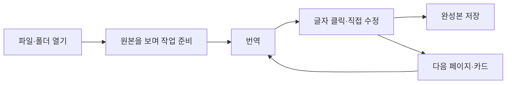

# 치pdf — 제품 기획서

제품명: 치pdf / 내부 프로젝트명: `localizer_desktop`

작성일: 2026-09-11 · 진행 갱신: 2026-09-14 · 상태: 단계 D·E 확장, 단계 F 설치 배포 구현

이 문서는 새 앱의 목표와 개발 범위를 정한다. 아래 기능은 새 앱의 구현 완료 내역이 아니다. 실제 상태는 각 구현 보고서와 최신 [0.8 구현 보고서](IMPLEMENTATION_08.ko.md)에 기록한다. 0.8은 직접 드래그한 문장의 OCR·빈 번역 상자·즉시 배경 복원과 브러시 지우기를 추가한다. 전체 V1은 아직 미완성이다.

2026-09-14 사용자 확정: 직접 사각형 선택을 기본으로 하고 페이지 자동 인식은 메뉴에 유지한다. OCR 원문은 별도 패널에서 확인하며 한국어 상자는 비워 둔다. 원문 제거와 브러시 지우기는 편집 화면에 즉시 반영하고, 원본 비교·실행 취소·작업 저장·완성본 출력에 연결한다.

2026-09-15 품질 수정: PDF에서 분리된 일본어는 원래 배경을 그대로 보존하는 방식으로 제거한다. 글자 마스크 방식도 처리하고 실제 배경을 작업 파일에 포함한다. 이전 작업에는 원본 PDF를 다시 연결해 기존 번역·배치를 유지하면서 원문 제거 배경만 갱신한다.

## 1. 만들려는 프로그램

**일본어 머미 자료를 열고, 번역한 결과 위에서 글자와 배치를 직접 고쳐 완성하는 Windows 설치형 편집기.**

사용자는 번역할 자료와 표현에 집중한다. 원문 인식, 글자 제거, 번역문 배치가 한 편집 화면 안에서 이어진다. PDF와 이미지도 같은 조작으로 다룬다. 편집 능력은 PowerPoint에서 문서를 꾸밀 때 사용하는 수준을 목표로 한다.

### 사용자와 합의한 방향

| 요구 | 제품에서의 의미 |
|---|---|
| 최대한 단순하고 편한 번역 작업 | 열기 → 번역 → 직접 수정 → 완성본 저장이 기본 흐름 |
| PowerPoint 정도의 편집 기능 | 텍스트·도형·이미지를 선택하고 자유롭게 배치·서식 지정 |
| 웹이 아닌 별도 설치 프로그램 | 브라우저를 띄우지 않는 자체 창, 바탕화면 아이콘과 설치 프로그램 |
| 기존 프로그램과 별도 개발 | `tools/localizer_desktop`에서 새 앱 개발 |
| 시작 전에 기획 | 작업 흐름·화면·기능·완료 기준을 먼저 문서화 |

### 이 기획에서 제안하는 기본값

- 파일을 열면 원본을 먼저 보여주고 편집할 글자 영역을 준비한다. 자동 번역은 사용자가 `번역`을 눌렀을 때 시작한다.
- 처음에는 현재 페이지를 번역한다. 버튼 옆 펼침 메뉴에서 현재 파일 전체 또는 선택 자료로 범위를 넓힌다.
- 자동 번역은 초안을 만든다. 사용자가 고친 번역과 배치는 기본적으로 유지한다.
- 작업 저장은 자동으로 한다. `완성본 저장`은 PDF·이미지를 만드는 별도 동작이다.
- 계정 없이 로컬 편집·저장·출력이 가능하도록 설계한다. 자동 번역 엔진은 초반 검증을 거쳐 결정한다.

이 기본값은 제품 제안이며, 사용자가 이미 선택한 세부 설정으로 간주하지 않는다.

## 2. 무엇을 단순하게 만들 것인가

기존 앱은 문장 편집, 이미지 지우기, OCR 확인, 문단, 양식, 검수 등을 각각 찾아 들어가야 했다. 새 앱에서는 **작업 화면과 선택한 대상**을 기준으로 기능을 모은다.

| 기존에 사용자가 따로 관리하던 일 | 새 앱의 기본 동작 |
|---|---|
| PDF 편집기와 이미지 편집기 선택 | 자료 종류에 관계없이 같은 편집기에서 열기 |
| OCR 화면에서 인식하고 다른 화면에서 배치 | 글자를 선택하면 원문 확인과 번역문 편집을 그 자리에서 제공 |
| 원문 영역·제거 영역·배치 영역을 먼저 이해 | 초기 위치는 자동으로 준비하고, 어긋난 부분만 `원문 확인` 또는 `배경 다듬기`에서 조정 |
| 저장·검수 상태를 여러 곳에서 확인 | 하단 저장 상태와 페이지의 확인 표시로 정리 |
| 제목·본문 서식을 매번 지정 | 선택한 상자의 서식 복사, 여러 상자에 한 번에 적용 |
| 모든 상세 설정을 화면에 노출 | 선택한 대상에 필요한 도구만 표시 |

새 기능을 추가할 때는 “사용자가 어느 장면에서 이 기능을 쓰는가”와 “현재 화면에서 처리할 수 있는가”를 먼저 확인한다. 기능마다 새 편집기나 별도 작업 모드를 만들지 않는다.

## 3. 대표 작업 흐름

### 3.1 카드 한 장

1. PNG 카드를 앱 창에 끌어다 놓는다.
2. 원본이 바로 보이고, 인식된 글자는 선택 가능한 상자로 준비된다. 처리 중에도 확대·이동은 가능하다.
3. `번역`을 누르면 인식 원문을 번역하고 글자 제거와 한국어 배치까지 연결해 초안을 보여준다.
4. 표현이 어색한 글자를 더블클릭해 직접 고친다. 상자 테두리로 크기를 바꾸고 드래그해 이동한다.
5. `원본 비교`로 확인하고 `완성본 저장`을 누른다. 기본 출력은 원래 크기의 PNG다.

정상적인 카드 한 장을 끝내기 위해 OCR 설정이나 별도 이미지 편집기를 열 필요가 없어야 한다.

### 3.2 본문이 긴 PDF

1. PDF를 열면 왼쪽에 페이지 썸네일, 가운데에 원래 페이지가 보인다.
2. 추출 가능한 글자는 텍스트 추출을 우선 사용하고, 필요한 부분에 OCR을 사용한다.
3. 문장과 배치를 분석해 문단 단위 초안을 만든다. 원문 영역의 연결은 내부에 보존한다.
4. 번역 후 해당 문단을 클릭해 고친다. 필요할 때 우클릭 메뉴에서 `문단 나누기`·`선택 글자 묶기`를 사용한다.
5. 글자가 넘치면 해당 상자 옆에 표시한다. 상자 확대, 글자 크기 조절, 문단 나누기를 선택할 수 있다.
6. 선택 페이지 또는 파일 전체를 PDF로 저장한다.

### 3.3 같은 형식의 카드 여러 장

1. 폴더 또는 여러 파일을 가져와 왼쪽 목록에서 고른다. 가져오기 요약에서 지원 파일과 제외 파일을 확인한다.
2. 한 장을 편집한 뒤 상자의 `서식 복사` 또는 `다른 카드에 배치 적용`을 사용한다.
3. 적용 대상과 미리보기를 확인한다. 다른 카드로 번역문이 복사되지 않는다.
4. 어긋난 카드만 고치고 다음 카드로 이동한다. 작업은 자동 저장된다.
5. 선택 자료의 완성본을 원래 폴더 구분에 맞춰 모아 저장한다. 실패·미처리 자료는 결과에 표시한다.

## 4. 화면 설계

기본 화면은 **왼쪽 자료 목록 + 가운데 편집 화면 + 상단 도구**다. 오른쪽 속성 창은 상세 조정이 필요할 때 펼친다.

| 영역 | 기본 표시 | 필요할 때만 표시 |
|---|---|---|
| 제목 표시줄 | 작품 이름, 자동 저장 상태, 창 조작 | 저장 실패 시 복구 안내 |
| 상단 | 파일 열기, 번역, 삽입, 실행 취소·다시 실행, 원본 비교, 완성본 저장 | 번역 범위, 출력 설정 |
| 왼쪽 | 자료·페이지 썸네일, 현재 선택, 간단한 작업 상태 | 폴더 펼침, 이름 검색, 다중 선택 |
| 가운데 | 원본 디자인과 현재 편집 결과 | 선택 테두리, 회전·크기 핸들, 정렬 안내선 |
| 선택 도구 | 텍스트 선택 시 글꼴·크기·색·정렬 | 줄 간격·여백·정밀 위치 등 상세 속성 |
| 하단 | 페이지 이동, 확대율, 작업 진행 상태 | 확인할 문제 수, 중단·재시도 |

### 선택에 따른 조작

| 사용자 행동 | 결과 |
|---|---|
| 상자 한 번 클릭 | 대상 선택, 이동·크기·회전 핸들과 관련 도구 표시 |
| 글자 더블클릭 또는 선택 후 Enter | 그 자리에서 번역문 편집. 한글 조합 입력과 부분 선택 지원 |
| 빈 곳 클릭 또는 Esc | 편집 종료 또는 선택 해제 |
| Shift 클릭·빈 곳 드래그 | 여러 개 선택 |
| 선택 대상 드래그 | 이동. 안내선에 맞춤 |
| 선택 대상 우클릭 | 복제, 정렬, 그룹, 앞뒤 순서, 잠금, 원문 확인 |
| `원문 확인` | 선택한 부분의 원본 확대와 원문을 작은 보조 영역에 표시 |
| `배경 다듬기` | 해당 글자의 제거 영역과 보호 브러시 표시. 종료하면 기본 편집으로 복귀 |
| 아무것도 선택하지 않음 | 일반 도구만 표시. 상세 속성 창은 접힘 |

`이동`과 `글자 입력`이 충돌하지 않도록 선택 상태를 명확히 표시한다. 글자를 입력하다 방향키를 누르면 커서가 움직이며, 상자를 선택한 상태에서는 상자가 움직인다.

## 5. 편집 기능 범위

아래의 **V1**은 실제 사용 가능한 첫 정식 범위다. 초기 시제품에서 일부만 검증하더라도 V1 완료를 선언할 때는 다음 기본 편집 기능을 갖춰야 한다.

| 분류 | V1에 포함할 기능 |
|---|---|
| 텍스트 | 상자 추가·삭제·복제, 직접 입력, 한글 IME, 여러 줄, 글꼴·크기·색, 굵게·기울임·밑줄·취소선, 부분 서식, 정렬, 줄·문단 간격, 내부 여백, 가로·세로쓰기 |
| 기본 도형 | 사각형·둥근 사각형·원·타원·선·화살표, 채우기·테두리·선 두께·투명도 |
| 이미지 | 삽입·교체, 이동·크기·회전·뒤집기, 비율 고정, 사각형 자르기, 투명도 |
| 공통 배치 | 다중 선택, 이동·크기·회전, 정렬·동일 간격, 안내선·맞춤, 그룹·그룹 해제, 잠금, 앞뒤 순서 |
| 편집 편의 | 복사·잘라내기·붙여넣기, 복제, 삭제, 실행 취소·다시 실행, 서식 복사, 텍스트 찾기·바꾸기 |
| 번역 | 현재 페이지·선택 대상·선택 자료 번역, 원문 확인·수정, 의심 원문 표시, 재번역 후보 비교, 용어집 적용 방식 표시 |
| 글자 제거 | 추출 가능한 PDF 글자 제거, 이미지 글자 제거, 영역 조정, 그림 보호, 원본 비교 |
| 반복 작업 | 텍스트 스타일 저장·적용, 다른 카드에 배치 적용, 내용 보존, 대상별 결과와 되돌리기 |
| 저장·출력 | 자동 저장·복구, 프로젝트 다른 이름으로 저장, PNG/JPEG/PDF 출력, 선택 자료 일괄 출력 |

### PowerPoint와의 범위 구분

목표는 문서의 글자·그림·도형을 편집하는 경험이다. 발표자 도구, 애니메이션, 전환 효과, SmartArt·차트, 공동 편집은 V1에 포함하지 않는다. 표 편집과 PPTX 입출력은 후속 요구로 관리한다.

기존 PDF·PNG를 열 때는 원래 디자인을 배경으로 보존하고, 번역할 글자 및 추가하는 텍스트·도형·이미지를 편집 가능한 대상으로 만든다. 원본 이미지 속 모든 그림을 자동으로 독립 도형으로 분해하는 기능을 약속하지 않는다.

### 기본 단축키

| 조작 | 단축키 |
|---|---|
| 실행 취소 / 다시 실행 | Ctrl+Z / Ctrl+Y, Ctrl+Shift+Z |
| 복사 / 잘라내기 / 붙여넣기 | Ctrl+C / Ctrl+X / Ctrl+V |
| 복제 / 전체 선택 | Ctrl+D / Ctrl+A |
| 그룹 / 그룹 해제 | Ctrl+G / Ctrl+Shift+G |
| 즉시 저장 / 찾기 | Ctrl+S / Ctrl+F |
| 정밀 이동 / 크게 이동 | 방향키 / Shift+방향키 |
| 편집 진입 / 편집·선택 종료 | Enter / Esc |

## 6. 자동 처리와 사용자의 수정

### 번역 버튼이 처리할 일

선택 범위에서 원문 준비 → 읽기 순서·문단 준비 → 번역 초안 → 글자 제거 → 한국어 배치를 연결한다. 사용자에게는 하나의 작업으로 보이되 자료별 진행·실패·중단 상태를 남긴다.

- 기존에 번역문이 있거나 사용자가 직접 고친 항목은 기본 제외한다. `다시 번역`은 선택 대상에 한해 별도 후보를 보여준다.
- 수정한 원문은 확정 상태를 갖는다. 재인식은 원문을 즉시 교체하지 않고 후보로 남긴다.
- 번역이 길면 줄바꿈을 먼저 조정한다. 글자 크기 자동 조정은 정한 하한 안에서만 수행한다. 여전히 넘치면 표시한다.
- 한국어 상자의 이동이 원문 인식이나 글자 제거 영역을 함께 이동시키지 않는다.
- 원문 수정 시 연결 문단과 번역의 확인 필요 상태를 갱신한다. 기존 번역·배치를 조용히 덮어쓰지 않는다.
- 낮은 OCR 신뢰도는 확인이 필요하다는 신호다. 높은 신뢰도도 정답으로 보장하지 않는다.
- 실패한 자료가 있어도 성공·실패·미처리를 모두 집계한다. 중단 후 미처리부터 재개할 수 있다.

### 번역 엔진 결정

현재 앱은 `self.Translator`를 사용하는 Chrome 내장 번역에 의존한다. 설치형 앱에 그대로 가져갈 수 있다고 가정하지 않는다. Chrome 공식 문서도 Translator API를 브라우저 제공 모델을 사용하는 API로 설명한다. [Chrome Translator API](https://developer.chrome.com/docs/ai/translator-api)

새 앱에는 번역 엔진을 교체할 수 있는 연결 계층을 둔다. 기본 엔진은 아래 검증 후 선택한다.

| 검증 | 결정 기준 |
|---|---|
| 일본어→한국어 대표 문장 20개 | 지문·대사·고유명사·긴 문단을 포함해 원문 대조 및 수정량 기록 |
| 설치와 동작 | 개발 도구가 없는 Windows 환경에서 실행, 필요한 모델 설치 과정 확인 |
| 속도와 자원 | 사용자 PC에서 실제 처리 시간·메모리·다운로드 크기 측정 |
| 기존 수정 보존 | 사용자가 고친 번역, 확정 용어, 연결 문단 처리 확인 |
| 로컬·외부 방식 | 로컬 실행을 우선 검토. 외부 방식은 비용과 전송 범위를 보여주고 사용자가 선택하도록 설계 |

엔진 미선정은 자동 번역 완성의 선행 과제다. 글자 편집기만 만들어 놓고 번역 앱이 완성됐다고 판단하지 않는다. 정확한 모델·외부 제공자·비용은 현재 미정이며 이 기획으로 가입이나 유료 사용을 결정하지 않는다.

## 7. 설치·저장·출력

### 설치형 앱

- 0.7.1부터 Windows 10 1809 이상과 Windows 11의 x64 PC를 설치 대상으로 한다. 실제 실행 검증 환경은 Windows 11이며 Windows 10 실기 검증은 후속으로 구분해 기록한다.
- 자체 프로그램 창과 Windows 파일 선택 창을 사용한다. 브라우저 탭, localhost 주소, 콘솔 실행이 기본 사용 흐름에 나타나지 않는다.
- 일반 사용자가 실행할 설치 프로그램과 개발 검증용 이동식 배포본을 구분한다.
- Python·Node·개발 도구를 별도로 설치하지 않고 실행할 수 있어야 한다.
- 앱 업데이트와 작업 저장 위치를 분리한다. 업데이트·앱 제거가 사용자 작업을 자동 삭제하지 않도록 한다.

### 프로젝트

프로젝트는 원본 사본, 페이지·객체 편집, 번역·원문, 용어집, 배경 복원 기록을 함께 관리한다. 내부 경로는 프로젝트 기준 상대 경로로 저장해 폴더 이동을 지원한다.

작업은 변경 후 자동 저장하고 하단에 저장 상태를 표시한다. 저장 실패 시 복구 가능한 편집본을 유지하고, 성공한 것처럼 표시하지 않는다. 강제 종료 후 마지막 정상 저장 상태 또는 복구본을 열 수 있어야 한다.

프로젝트의 정확한 확장자와 단일 파일 포장 방식은 초기 저장·복구 실험에서 확정한다. 개발 초반에는 버전이 있는 manifest와 원본·편집 데이터가 들어 있는 디렉터리를 기준으로 설계한다.

### 완성본

| 입력 | 기본 출력 | 필수 확인 |
|---|---|---|
| PNG | 원래 크기의 PNG | 투명도, 글자 위치, 배경 변경 범위 |
| JPEG | PNG 또는 JPEG 선택 | JPEG의 투명도 미지원과 압축 설정을 출력 선택 시 안내 |
| PDF | 원래 페이지 크기·순서의 PDF | 페이지 누락, 글꼴, 줄바꿈, 원본과 의도하지 않은 차이 |
| 여러 자료 | 선택한 폴더에 파일별 출력 | 원래 하위 폴더 구분, 이름 충돌, 성공·실패·미처리 목록 |

편집 화면과 최종 출력의 글꼴·줄바꿈·위치가 일치해야 한다. 출력할 때마다 사용자가 다른 결과에 맞춰 다시 조정하는 흐름을 허용하지 않는다.

## 8. 기술 방향과 재사용

### 제안: Python + PySide6 기반 데스크톱 UI

기존의 Python PDF·OCR 처리 기반을 살리면서 네이티브 창과 하나의 편집 화면을 새로 만든다. 최종 채택은 첫 기술 검증 단계에서 한글 입력, 선택·변형, 출력 일치를 확인한 뒤 확정한다.

Qt의 Graphics View 계열은 2D 객체 장면을 구성하는 기반을 제공한다. `QGraphicsTextItem`과 `QUndoStack` 등은 텍스트 객체와 실행 취소 구현의 기반 후보다. 이 도구들이 PowerPoint 수준 편집기를 완성해 주는 것은 아니며, 다중 선택·변형 핸들·문서 모델·한글 입력·정확한 출력을 별도로 구현하고 검증해야 한다. [QGraphicsScene](https://doc.qt.io/qtforpython-6/PySide6/QtWidgets/QGraphicsScene.html), [QGraphicsTextItem](https://doc.qt.io/qtforpython-6/PySide6/QtWidgets/QGraphicsTextItem.html), [QUndoStack](https://doc.qt.io/qtforpython-6/PySide6/QtGui/QUndoStack.html)

Windows 실행 파일 패키징은 Qt가 안내하는 `pyside6-deploy`와 기존 배포 경험을 비교해 검증한다. 설치 프로그램 제작은 별도 단계로 둔다. 정확한 버전과 패키징 도구는 동작 시험 후 고정한다. [Qt for Python 배포](https://doc.qt.io/qtforpython-6/deployment/index.html), [pyside6-deploy](https://doc.qt.io/qtforpython-6/deployment/deployment-pyside6-deploy.html)

### 재사용 경계

| 기존 자산 | 활용 방법 |
|---|---|
| `pdf_renderer.py`, PDF 추출·합성 처리 | 새 문서 모델에 연결하는 어댑터로 분리. 원본 렌더링과 출력 검증 재사용 |
| OCR 런타임·일본어 모델·영역 인식 | 작업 큐를 통해 실행. 현재 검출 한계와 실패 기록도 검증 표본으로 활용 |
| `text_eraser.py`, 이미지 합성 | 객체에 연결된 제거·보호 기록으로 옮기고 동일 화면의 배경 조정 도구에 연결 |
| 저장·충돌·복구 로직 | 새 프로젝트 형식에 맞게 검증하며 재사용 |
| 용어집·번역 메모리·원문 확정 규칙 | 새 작업 흐름에서 필요한 연결만 사용 |
| 기존 테스트·실제 자료 점검 기록 | 회귀 기준으로 활용. 새 UI 사용성 검증을 대신하지 않음 |
| 현재 HTML·JavaScript 화면 | 동작 참고 및 필요한 순수 로직 이식. 기존 화면 구조 전체를 새 앱에 복사하지 않음 |

### 내부 설계 원칙

1. 문서 모델이 원본이다. 화면 객체나 특정 번역 엔진의 응답을 프로젝트 파일 형식으로 그대로 저장하지 않는다.
2. 페이지·텍스트·도형·이미지·그룹은 안정적인 식별자를 갖는다. 텍스트는 원문 연결과 번역 내용을 함께 추적한다.
3. 원문 인식 영역, 제거·보호 영역, 출력 상자의 위치를 별도 데이터로 보존한다. 사용자는 필요할 때 해당 목적의 도구로 조절한다.
4. 편집 명령을 통해 변경하고 실행 취소·다시 실행·자동 저장을 연결한다. 길게 드래그한 동작은 하나의 편집으로 취급한다.
5. OCR·번역·배경 복원은 화면을 막지 않는 작업자로 실행한다. 늦게 도착한 결과가 이후 수동 편집을 덮어쓰지 않도록 문서 버전을 확인한다.
6. 텍스트의 줄바꿈·크기·배치 계산을 미리보기와 출력이 공유한다. Qt와 기존 PDF 합성의 좌표·글꼴 차이는 초기 검증 과제다.
7. 필요한 처리 모듈을 새 폴더로 분리·관리한다. 배포 앱이 옆의 기존 개발 폴더를 실행 시 의존하지 않게 한다.

## 9. 기존 작업 가져오기

기존 앱과 데이터는 새 앱의 개발용 데이터로 직접 쓰지 않는다. 복사본으로 변환과 검증을 수행한다.

- 원본 파일·페이지 연결, 일본어 원문, 한국어 번역, 배치·서식, 용어집을 우선 이전한다.
- 기존 이미지에는 문장 편집 기록과 이미지 지우기 편집 기록이 따로 있을 수 있다. 현재 사용하던 결과 정보를 기준으로 기본 편집본을 정하고 다른 기록도 보관한다.
- 두 기록의 내용을 임의로 합쳐 중복 글자가 생기게 하지 않는다. 선택이 필요한 경우 가져오기 요약에서 한 번 확인한다.
- 새 형식으로 옮기기 어려운 속성은 해당 항목과 보존 방법을 변환 보고서에 표시한다. 조용히 삭제하지 않는다.
- 이전 전후 원문·번역·좌표·스타일·참조 파일과 렌더링 결과를 비교한다. 실패한 변환은 기존 데이터에 영향을 주지 않는다.

기존 포맷과의 양방향 동기화는 V1 목표가 아니다. 검증된 가져오기로 새 앱에서 작업을 이어가는 것을 목표로 한다.

## 10. 개발 순서와 완료 기준

사용자에게 보여줄 수 있는 결과를 단계마다 만든다. 초기 시제품과 실제 사용 가능한 V1을 구분한다.

| 단계 | 만들 결과 | 통과 기준 |
|---|---|---|
| A. 기획·화면 검토 | 이 기획서와 주요 화면 설계 | 기본 흐름과 V1 편집 범위가 명확함 |
| B. 기술 검증 | 자체 창, 카드 한 장, 한글 텍스트 상자, 저장·출력 실험, 번역 엔진 비교 | 한글 조합·부분 서식·드래그·Undo가 동작하고 저장 후 같은 모습으로 열림. 번역 엔진과 출력 경로의 실행 가능성 확인 |
| C. 첫 사용 흐름 | 열기 → 번역 → 클릭 수정 → PNG 저장 | 실제 카드 한 장을 다른 편집기·OCR 화면으로 이동하지 않고 완성. 자동 번역도 실제 동작 |
| D. 기본 편집 완성 | 5절의 텍스트·도형·이미지·배치·편집 편의 | 다중 선택·그룹·잠금·부분 서식·자르기·Undo와 저장/재열기 검증 |
| E. 작품 작업 | 여러 페이지 PDF, 카드 묶음, 서식·배치 재사용, 일괄 출력 | 기존 표본 PDF 2개·카드 10장에서 누락 없이 작업. 내용 보존과 예외 수정 검증 |
| F. 이전·설치 배포 | 기존 작업 가져오기, 설치 프로그램, 복구·출력 점검 | 개발 도구 없는 Windows 환경에서 설치·실행·업데이트. 작업 이전과 복구 통과 |

단계 B를 통과한 뒤 작업량과 일정 추정을 다시 작성한다. 현재는 전체 기간을 확정하지 않는다. 특히 독립 번역 엔진과 편집 화면/출력 일치는 일정에 큰 영향을 준다.

## 11. 사용자 관점의 검증

다음 숫자는 **아직 측정되지 않은 목표**다. 기능 개수와 자동 테스트 통과 수만으로 사용하기 편하다고 판단하지 않는다.

| 목표 | 확인 방법 |
|---|---|
| 일반 카드에서 화면 이동 0회 | 한 편집 화면에서 번역·원문 대조·글자 수정·배경 조정 완료 |
| 번역 시작은 기본 1회 클릭 | 초기 엔진 준비 이후 현재 페이지 번역에 불필요한 설정 창이 뜨지 않음 |
| 글자 수정은 더블클릭 후 바로 입력 | 텍스트 상자를 찾거나 별도 목록을 검색하지 않고 수정 |
| 필수 고급 설정 0개 | 일반 카드 완성까지 OCR 방향·마스크·좌표값을 사용자가 먼저 지정하지 않아도 됨 |
| 반복 배치 조작 절반 이하 | 같은 카드 10장을 개별 배치한 조작 수와 서식·배치 재사용 후 조작 수 비교 |
| 편집 내용 보존 | 자동 처리·문단 변경·재열기·복구 후 원문·번역·배치·서식 비교 |
| 미리보기와 출력 일치 | 긴 한국어·부분 서식·세로쓰기·회전·투명 이미지의 결과를 렌더링해 비교 |
| 긴 작업에도 화면 조작 가능 | OCR·번역 중 확대·이동·중단이 가능하고 처리 현황이 갱신됨 |

검증 표본은 기존 PL 핸드아웃 PDF, GM PDF, 배포 카드 10장에 더해 세로쓰기·긴 한국어·도형 겹침·투명 이미지·다른 크기의 카드를 보충한다. 실제 자료와 인위적 시험 자료의 결과를 구분한다.

## 12. 먼저 확인할 위험과 결정 사항

| 항목 | 현재 상태 | 결정 시점 |
|---|---|---|
| 독립 자동 번역 엔진 | 미정. Chrome 내장 기능을 그대로 재사용하지 않음 | 단계 B |
| PySide6 편집 화면 적합성 | 우선 제안. 한글 IME·부분 서식·세로쓰기·선택/변형 검증 필요 | 단계 B |
| 텍스트 미리보기와 PDF 출력 | 공통 레이아웃 경로를 설계하고 실제 렌더링으로 확인 | 단계 B |
| 원본 글자 제거 품질 | 기존 기반 활용. 복잡한 배경에는 개별 조정 필요 | 단계 C·E |
| 기존 두 이미지 편집 기록 이전 | 활성 편집본 선택과 나머지 기록 보존 규칙 필요 | 단계 E·F |
| 배포 구성·모델·폰트 | 용량·설치·배포 조건과 필요한 고지 확인 | 단계 B·F |
| 앱 이름·아이콘·파일 확장자 | 가칭 사용. 핵심 흐름 검증 후 결정 가능 | 단계 D·F |

### 바로 다음 작업

0.5까지 기본 텍스트 편집, OCR·로컬 번역 초안·원문 대조, 도형·이미지·정렬·간격·순서·잠금·복사·붙여넣기, 중첩 그룹과 안쪽 편집, 맞춤 안내선, 줄·문단 간격과 여백을 연결했다. 이후 사용자와 합의한 우선순위에 따라 PDF·여러 카드·작품 단위 저장·PNG/PDF 묶음 출력을 먼저 확장했다. 실제 PDF 2개와 카드 10장의 27페이지 저장·재열기·출력을 검증했다. 번역 품질 기준 전체와 단계 D·E 전체를 통과한 상태는 아니다.

0.6에서는 같은 화면의 세로 한글 편집과 개인 서식 저장, 다른 카드의 문구를 유지하는 배치 재사용을 추가했다. 배치는 같은 크기·같은 글상자 수의 카드에서 대응 목록을 확인해 적용한다. 실제 반복 조작 시간이 얼마나 줄었는지에 대한 사용자 측정은 아직 하지 않았다.

0.7에서는 한국어 설치 마법사와 시작 메뉴 등록, 기존 위치 업데이트, 제거·재설치 시 작업 보존을 추가했다. 실행 중 편집기를 강제로 닫지 않으며 이전 버전 덮어쓰기와 다른 설치 폴더로의 업데이트를 거절한다. 전체 113개 테스트와 별도 설치 등록으로 수행한 0.6→0.7 업데이트·제거·재설치 검증을 통과했다. 온라인 자동 업데이트·코드 서명·다른 PC 검증은 아직 남아 있다.

다음은 카드 순서 변경·삭제와 작품 작업 흐름을 다듬는다. 기존 앱 작업 이전, 작품 전체 자동 번역과 번역 품질 개선도 남아 있다. 세로 편집의 기본 문자 배치는 지원하지만 일본어 출판용 금칙·루비·세로 안 가로쓰기는 후속 범위다. PDF 가져오기와 출력은 페이지의 모습을 이미지로 보존하며 원래 PDF의 벡터 객체 편집·선택 가능한 텍스트 출력은 아직 없다. 기존 앱의 후속 기능 추가보다 새 앱의 한 화면 작업 흐름을 우선한다.
